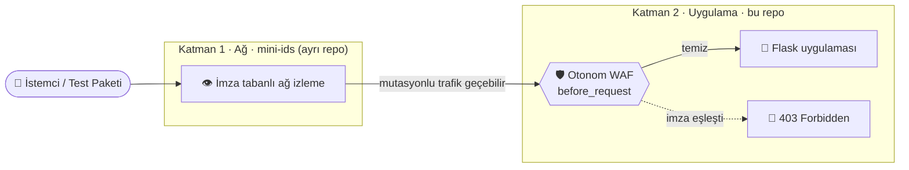
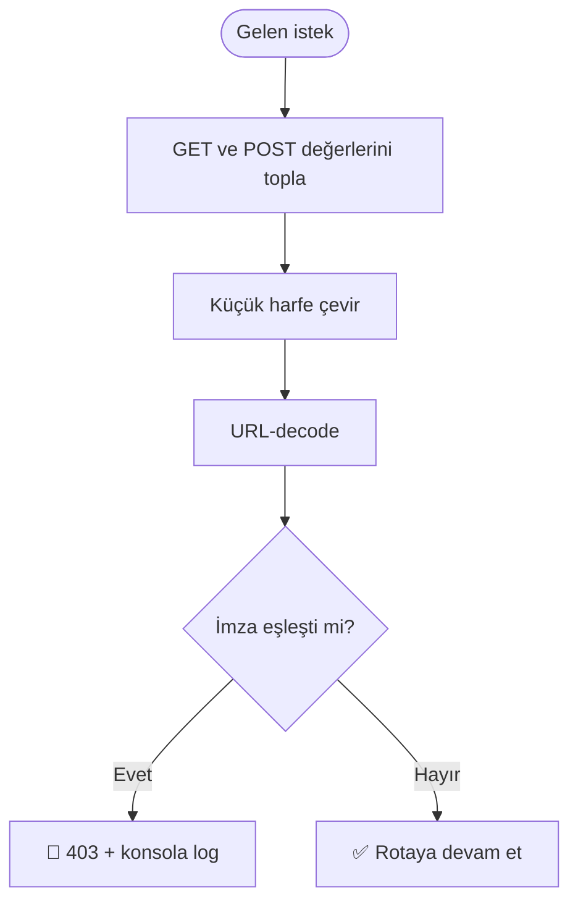

<div align="center">

# 🛡️ Zero Trust Layer-7 WAF Lab

### IDS'in kaçırdığını uygulama katmanında yakalayan otonom WAF <br/> ve onu kanıtlayan, yalnızca yerelde çalışan bir regresyon test paketi


[🚀 Hızlı Başlangıç](#-hızlı-başlangıç) · [🏗️ Mimari](#%EF%B8%8F-mimari) · [🧪 Test Paketi](#-test-paketi) · [⚠️ Sınırlar](#%EF%B8%8F-bilinen-sınırlar) · [🔐 Güvenlik Politikası](SECURITY.md)

</div>

<!--
  Demo GIF'i / rapor ekran görüntüsü hazır olunca docs/ klasörüne koyup aşağıdaki satırların yorumunu kaldır:
  
  
-->

> [!WARNING]
> **Bu depo bir saldırı aracı değildir.** İçindeki uygulama *bilerek* zafiyetlidir ve yalnızca kendi bilgisayarında (`127.0.0.1`) çalıştırılmak üzere tasarlanmıştır. Test paketi, hedef loopback dışındaysa çalışmayı reddeder. Ayrıntılar için [SECURITY.md](SECURITY.md).

---

## 📖 Hikâye

Ağ katmanında çalışan imza tabanlı bir IDS ([`mini-ids`](https://github.com/<KULLANICI_ADI>/mini-ids)) yazdım. Sonra şunu fark ettim: payload'ı biraz **mutasyona uğratmak** (harf çeşitlemesi, URL kodlama, yorum hileleri) çoğu zaman imza eşleşmesini kaçırtıyor.

**Zero Trust'ın cevabı basit:** ağ katmanına güvenme, her isteği uygulamanın kapısında yeniden doğrula.

Bu repo o fikrin çalışan kanıtı:

1. 🎯 Bilerek zafiyetli küçük bir Flask uygulaması (SQLi + XSS),
2. 🛡️ Her isteği rotaya ulaşmadan denetleyen otonom bir **Layer-7 WAF**,
3. 🧪 WAF'ın mutasyonlu payload'lara karşı dayanıklılığını ölçen, **yalnızca loopback'e kilitli** bir test paketi.

---

## 🏗️ Mimari

> Kavramsal görünüm. `mini-ids` ayrı bir repodur, bu depoda çalışma zamanında entegre değildir.



### WAF bir isteği nasıl değerlendirir?



---

## ✨ Öne Çıkanlar

| 🛡️ Otonom WAF | 🧪 Regresyon Test Paketi | 🔒 Loopback Kilidi |
|---|---|---|
| Flask `before_request` kancası ile her isteği rota çalışmadan önce denetler | Site haritalama → form keşfi → payload mutasyonları → rapor | Hedef `127.0.0.1` / `localhost` dışındaysa araç çalışmayı reddeder |
| **📊 JSON + HTML Rapor** | **🎯 Bilinçli Zafiyetli Hedef** | **🧱 Katmanlı Savunma** |
| Koyu temalı, risk renkli HTML rapor ve makine okunur JSON | `/giris` (SQLi) ve `/yorum` (XSS) ile güvenli bir oyun alanı | Ağ (IDS) + uygulama (WAF) katmanlarının birbirini tamamlaması |

---

## 🚀 Hızlı Başlangıç

**Gereksinimler:** Python 3.10+

```bash
git clone https://github.com/<KULLANICI_ADI>/web-security-lab.git
cd web-security-lab

python -m venv venv
# Windows:      venv\Scripts\activate
# macOS/Linux:  source venv/bin/activate

pip install -r app/requirements.txt -r tests/requirements.txt
```

**Terminal 1: hedef uygulama + WAF**

```bash
cd app
python vulnerable_app.py
# → http://127.0.0.1:5001
```

**Terminal 2: test paketi**

```bash
cd tests
python security_test_suite.py --url http://127.0.0.1:5001/ --no-report
```

HTML/JSON rapor da istersen:

```bash
python security_test_suite.py --url http://127.0.0.1:5001/ --output reports/test_raporu
```

---

## 🎬 Canlı Çıktı

Test paketi (Terminal 2):

```text
============================================================
OTOMATİK GÜVENLİK TESTİ BAŞLIYOR: http://127.0.0.1:5001/
============================================================
[TEST KAPSAMI] http://127.0.0.1:5001/ haritalanıyor...
[TEST KAPSAMI] http://127.0.0.1:5001/hakkinda haritalanıyor...
[TEST KAPSAMI] http://127.0.0.1:5001/giris haritalanıyor...
[TEST KAPSAMI] http://127.0.0.1:5001/yorum haritalanıyor...

[+] http://127.0.0.1:5001/giris sayfasında 1 test noktası bulundu.
[+] http://127.0.0.1:5001/yorum sayfasında 1 test noktası bulundu.
...
[BAŞARILI] Tüm saldırı payloadları WAF tarafından engellendi! (0 Zafiyet)
```

WAF günlüğü (Terminal 1):

```text
[🛡️ WAF] SALDIRI BLOKLANDI! Yakalanan İmza: or '1'='1
127.0.0.1 - - [30/Sep/2026 11:45:20] "POST /giris HTTP/1.1" 403 -
```

### 📈 Gerçek sonuç

| Metrik | Değer |
|---|:---:|
| Toplam payload | **11** |
| WAF'ta engellenen (HTTP 403) | **10** |
| WAF'tan geçen ama bulgu üretmeyen | **1** |
| Raporlanan zafiyet bulgusu | **0** |

> [!NOTE]
> Geçen tek payload, imzası bulunmayan basit bir "sonda"dır. Uygulamada hata ya da başarı sinyali üretmediği için bulgu sayılmaz. Bu, imza tabanlı yaklaşımın doğasını gösteren dürüst bir örnektir; bkz. [Bilinen Sınırlar](#%EF%B8%8F-bilinen-sınırlar).

---

## 🧪 Test Paketi

`tests/security_test_suite.py` bir tarayıcı değil, **WAF için regresyon testidir**: hedefi haritalar, formları bulur, payload'ları gönderir ve WAF'ın tepkisini yorumlar.

### Kapsam

| Zafiyet ailesi | Denenen mutasyon türleri | Payload |
|---|---|:---:|
| **SQL Injection** | klasik varyantlar, harf çeşitlemesi, URL kodlama, yorum hilesi, basit sonda | 7 |
| **XSS** | temel etiket, harf çeşitlemesi, URL kodlama, alternatif etiket | 4 |

### Karar mantığı

| Gözlem | Yorum |
|---|---|
| HTTP `403` | ✅ WAF engelledi, bulgu yok |
| Yanıtta SQL hata imzası | 🚨 Hata tabanlı SQLi bulgusu (Critical) |
| Yanıtta başarılı giriş işareti | 🚨 Mantık tabanlı SQLi bulgusu (Critical) |
| Payload işaretçisi yanıtta yansıdı | 🚨 Yansıyan XSS bulgusu (High) |

### Komut satırı

| Bayrak | Açıklama |
|---|---|
| `--url` | Test edilecek hedef (zorunlu, birden fazla verilebilir) |
| `--no-crawl` | Sadece verilen URL'yi test et, siteyi gezme |
| `--output` | Rapor dosya yolu (uzantısız) |
| `--no-report` | Sadece terminale yaz, rapor üretme |

### 🔒 Güvenlik kilidi

Hedef `127.0.0.1`, `localhost` veya `::1` değilse araç hiçbir istek göndermeden çıkar:

```text
[🔴 GÜVENLİK İHLALİ DENEMESİ]
Bu test aracı sadece etik test amacıyla sınırlandırılmıştır.
'example.org' hedefine test yapılmasına izin verilmiyor.
```

> Kilit bir *güvenlik sınırı* değil, niyeti ve kapsamı açıkça ortaya koyan bir **kötüye kullanım önlemidir**. Bkz. [SECURITY.md](SECURITY.md).

---

## 🧠 WAF Yetmez: Kalıcı Çözüm

WAF burada bir **sanal yamadır**. Asıl düzeltme kodun kendisindedir. Bu lab'daki iki zafiyetin doğru karşılıkları:

```python
# ❌ Zafiyetli: string birleştirme
sorgu = f"SELECT * FROM kullanicilar WHERE kullanici_adi = '{kullanici}' AND sifre = '{sifre}'"
cursor.execute(sorgu)

# ✅ Güvenli: parametreli sorgu
cursor.execute(
    "SELECT * FROM kullanicilar WHERE kullanici_adi = ? AND sifre = ?",
    (kullanici, sifre),
)
```

```python
# ❌ Zafiyetli: kullanıcı girdisini f-string ile HTML'e gömmek
yorum_listesi_html = "".join(f"<li>{y}</li>" for y in yorumlar)
render_template_string(f"<ul>{yorum_listesi_html}</ul>")

# ✅ Güvenli: değişkeni şablona ver, Jinja otomatik kaçışlasın
render_template_string(
    "<ul><li>{{ y }}</li></ul>",
    yorumlar=yorumlar,
)
```

> Savunma derinliği: **doğru kod + WAF + IDS**. Hiçbiri tek başına yeterli değil.

---

## ⚠️ Bilinen Sınırlar

Bu bir eğitim laboratuvarıdır, üretim WAF'ı değil. Sınırları açıkça yazmak projenin bir parçası:

- **İmza tabanlı, kısa bir kara liste.** Sabit imza listesi ve tek geçişli normalizasyon kullanır. ModSecurity + OWASP CRS gibi olgun kural setlerinin yerini tutmaz.
- **Yalnızca query string ve form değerlerini denetler.** Başlıklar, çerezler ve JSON gövdeleri kapsam dışıdır.
- **Alttaki uygulama hâlâ zafiyetlidir.** WAF'ı aşan bir girdi doğrudan zafiyete ulaşır. Bu bilinçli bir tasarımdır.
- **"0 bulgu", "güvenli" demek değildir.** Sonuç yalnızca bu 11 payload için geçerlidir.
- **Kimlik doğrulama, oturum yönetimi, hız sınırlama ve CSRF koruması yoktur.** Parolalar seed verisinde düz metindir.
- **Flask geliştirme sunucusu** kullanılır, yorumlar bellekte tutulur.

---

## 🗂️ Repo Yapısı

```text
web-security-lab/
├── app/
│   ├── vulnerable_app.py        # Zafiyetli uygulama + WAF katmanı
│   └── requirements.txt
├── tests/
│   ├── security_test_suite.py   # WAF regresyon test paketi (loopback kilitli)
│   ├── report.py                # JSON + HTML rapor üretici
│   ├── requirements.txt
│   └── reports/                 # Üretilen raporlar (git'e girmez)
├── docs/                        # Ekran görüntüleri / demo GIF
├── SECURITY.md
└── README.md
```

---

## 🛣️ Yol Haritası

- [ ] Parametreli sorgu + çıktı kodlaması ile düzeltilmiş bir dal (öncesi/sonrası karşılaştırması)
- [ ] WAF kurallarını harici bir YAML dosyasına taşımak
- [ ] Başlık, çerez ve JSON gövdesi denetimi
- [ ] `pytest` + GitHub Actions ile otomatik regresyon
- [ ] `mini-ids` ile ortak log formatı ve olay korelasyonu

---

## 🤝 Katkı ve Güvenlik

- Fikir, WAF iyileştirmesi ya da hata için **Issue** veya **Pull Request** açabilirsin.
- Güvenlikle ilgili bildirimler için lütfen [SECURITY.md](SECURITY.md) dosyasındaki yolu izle.
- Lisans: [MIT](LICENSE)

---

<details>
<summary><b>🇬🇧 English summary</b></summary>

<br/>

**Zero Trust Layer-7 WAF Lab** is an educational project showing how an application-layer WAF can catch mutated (evasion-style) payloads that a signature-based network IDS may miss.

- A deliberately vulnerable Flask app (SQLi + XSS) with a `before_request` WAF.
- A regression test suite that crawls the target, submits mutated payloads and generates JSON/HTML reports.
- **Loopback-only:** the test suite refuses to run against anything except `127.0.0.1` / `localhost`.
- Verified result: 11 payloads, 10 blocked with HTTP 403, 1 passed without producing a finding, 0 reported vulnerabilities.

This is **not** a production WAF and **not** an attack tool. See [SECURITY.md](SECURITY.md) for scope, acceptable use and reporting.

</details>
